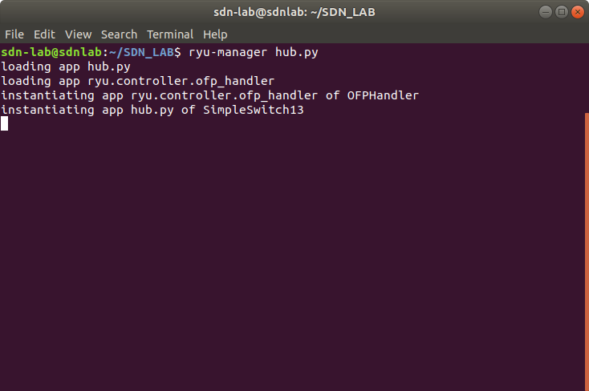
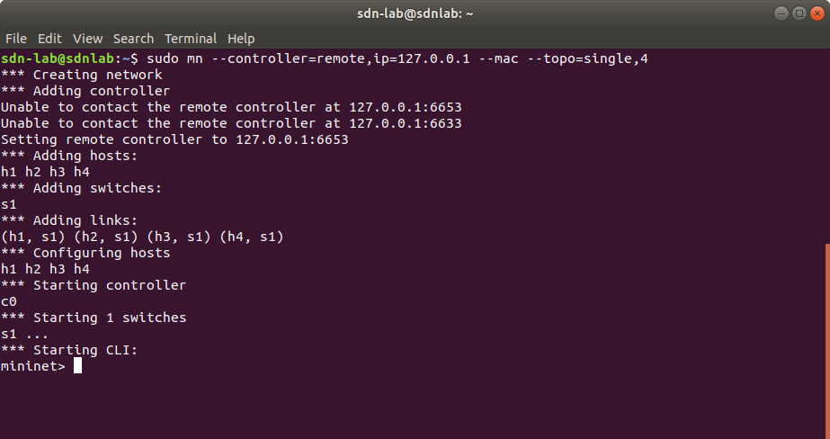
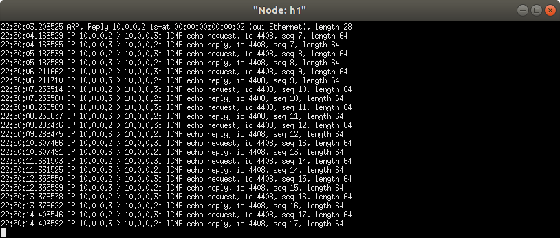
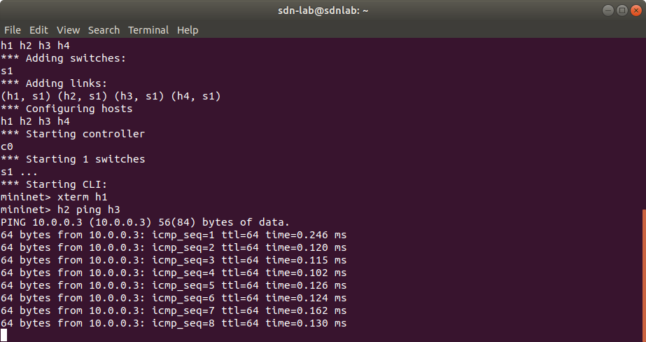

# OpenFlow Switching Applications

# 1.Hub Application

# hub.py

When a data frame arrives at a port in hub, it is simply broadcast to every other port, without considering whether it is destined for a particular destination or not. ```hub.py``` is simply braodcast the packets out of every port without sending the packets to the controller.


To run the hup.py application

In one terminal run the ryu controller using the follwing command

  ```ryu-manager hub.py```
  
  
  
In another terminal run the mininet
  
  ```sudo mn --controller=remote,ip=127.0.0.1 --mac --topo=single,4```
  
  
  
In mininet terminal if you do a ```pingall``` you won't see any flow installed by the controller this is because the OpenFlow switch (which is acting as a hub in this case) will not forward any packet to the controller. The switch will simply broadcast the out of every port. There will be one entry with **action = FLOOD**.

Now on ```mininet>``` CLI type ```xterm h1``` which will open ```h1``` terminal and type ```tcpdump -i any``` to capture the packet.


  

Now on ```mininet>``` type ```h2 ping h3``` , h2 will ping h3 but as the OpenFlow switch acting as a hub it will broadast all the packet out of every ports which will be seen by host h1 as well.

  


  
  
  


